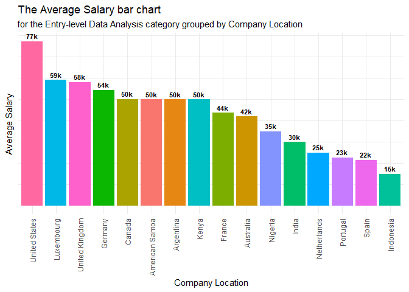
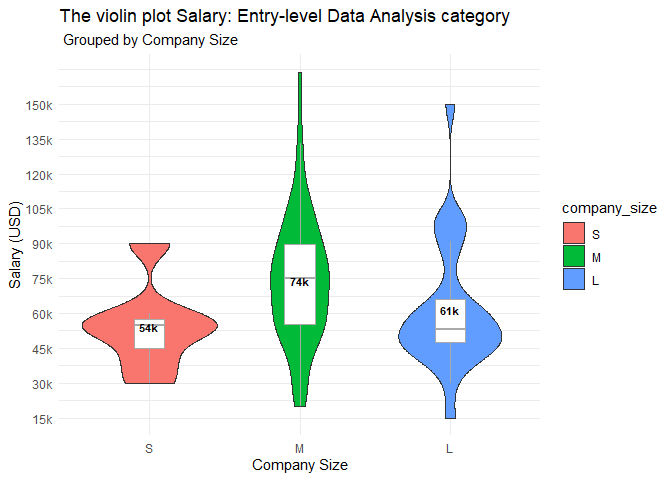
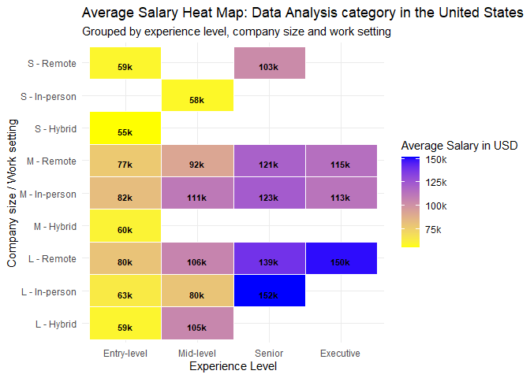

Jobs and Salaries in Data-Related Careers
================

- [1 Purpose of the Analysis](#1-purpose-of-the-analysis)
- [2 Data source and Data
  description](#2-data-source-and-data-description)
- [3 Preparing the data for
  analysis](#3-preparing-the-data-for-analysis)
- [4 Cleaning steps](#4-cleaning-steps)
- [5 Preliminary statistics](#5-preliminary-statistics)
- [6 Analysis and Visuals](#6-analysis-and-visuals)
  - [6.1 Average salary x `job_category` x
    `experience level`](#61-average-salary-x-job_category-x-experience-level)
  - [6.2 Exploring the Entry-level Data Analysis
    category](#62-exploring-the-entry-level-data-analysis-category)
  - [6.3 Where does the Entry-level Data Analysis job category have the
    best
    salaries?](#63-where-does-the-entry-level-data-analysis-job-category-have-the-best-salaries)
  - [6.4 How does the company size influence the Entry-level Data
    Analysis
    salary?](#64-how-does-the-company-size-influence-the-entry-level-data-analysis-salary)
  - [6.5 How does the work setting influence the Entry-level Data
    Analyst’s
    salary?](#65-how-does-the-work-setting-influence-the-entry-level-data-analysts-salary)
  - [6.6 Scenario: Data Analysis career in the United
    States](#66-scenario-data-analysis-career-in-the-united-states)
- [7 Key Insights and
  Recommendations:](#7-key-insights-and-recommendations)

This document is a case study prepared as part of the Google Data
Analytics Capstone. It follows the six steps of the data analysis
process, which are as follows: ask, prepare, process, analyze, share,
and act.

This report comprises the following elements:

- A clear statement of the business task and its purpose.
- A comprehensive description of the data sources utilized.
- Documentation of the cleaning and data manipulation phase.
- The analysis with supporting visualizations and key findings.
- Valuable insights and additional deliverables for further exploration.

# 1 Purpose of the Analysis

In the dynamic and rapidly evolving landscape of data-related careers,
understanding the scenario of job roles and salary trends is crucial for
professionals seeking to navigate their career paths. By exploring key
aspects such as the different job roles, location, experience level, and
average salary, the study aims to provide a roadmap and valuable
insights for aspiring entry-level data-related professions.

- **Business Task**: A meaningful salary overview in Data-related
  careers around the globe, including the most enticing job roles, and
  career perspectives, with a focus on the Entry-level Data Analysis
  profession.

- **Key Stakeholder:** In this case study, the primary stakeholder is
  the data analyst conducting the analysis. In the following, I list
  several guiding questions to be answered with the analysis:

  - How the data is organized?
  - Are there issues with bias or credibility in this data?
  - What steps have you taken to ensure that your data is clean?
  - What tools are you choosing for the analysis?
  - How do factors like country, job title, company size, and experience
    level impact on the salary?
  - What trends or relationships did you find in the data?
  - How will these insights help the target audience make decisions?

# 2 Data source and Data description

The data is located at [ai-jobs.net](https://ai-jobs.net/salaries/2023/)
and entitled “The Global AI, ML, Data Science Salary Index for 2023”
which is based on internal data survey submissions and jobs with open
salaries, as the authors describe the data. The data is processed and
updated every week. You can contribute to them by submitting your salary
info.

I have downloaded the data set from Hummaam Qaasim’s profile in
[Kaggle](https://www.kaggle.com/datasets/hummaamqaasim/jobs-in-data),
where you can find the data card, the Metadata, and the License.

The data set contains a single table with the following columns:

- **`work_year`**: The year in which the data was recorded.
- **`job_title`**: The specific title of the job role, like ‘Data
  Scientist’, ‘Data Engineer’, or ‘Data Analyst’.
- **`job_category`**: A classification of the job role into broader
  categories for easier analysis.
- **`salary_currency`**: The currency in which the salary is paid, such
  as USS and EUR.
- **`salary`**: The annual gross salary of the role in the local
  currency.
- **`salary_in_usd`**: The annual gross salary converted to United
  States Dollars (USD). This uniform currency conversion aids in global
  salary comparisons and analyses.
- **`employee_residence`**: The country of residence of the employee.
- **`experience_level`**: Classifies the professional experience level
  of the employee. Common categories might include ‘Entry-level’,
  ‘Mid-level’, ‘Senior’, and ‘Executive’.
- **`employment_type`**: Specifies the type of employment, such as
  ‘Full-time’, ‘Part-time’, and ‘Contract’.
- **`work_setting`**: The work setting or environment, like ‘Remote’,
  ‘In-person’, or ‘Hybrid’.
- **`company_location`**: The country where the company is located.
- **`company_size`**: The size of the employer company, often
  categorized into small (S), medium (M), and large (L) sizes.

# 3 Preparing the data for analysis

I have used the RStudio and the R Markdown to manipulate, transform,
analyze, and create the visuals.

- Reading the file and preview:

``` r
data_df <- read.csv("jobs_in_data.csv") #reading the data set from the same folder/repository

head(data_df) # return the first rows
```

    ##   work_year            job_title                   job_category salary_currency
    ## 1      2023 Data DevOps Engineer               Data Engineering             EUR
    ## 2      2023       Data Architect Data Architecture and Modeling             USD
    ## 3      2023       Data Architect Data Architecture and Modeling             USD
    ## 4      2023       Data Scientist      Data Science and Research             USD
    ## 5      2023       Data Scientist      Data Science and Research             USD
    ## 6      2023       Data Scientist      Data Science and Research             USD
    ##   salary salary_in_usd employee_residence experience_level employment_type
    ## 1  88000         95012            Germany        Mid-level       Full-time
    ## 2 186000        186000      United States           Senior       Full-time
    ## 3  81800         81800      United States           Senior       Full-time
    ## 4 212000        212000      United States           Senior       Full-time
    ## 5  93300         93300      United States           Senior       Full-time
    ## 6 130000        130000      United States           Senior       Full-time
    ##   work_setting company_location company_size
    ## 1       Hybrid          Germany            L
    ## 2    In-person    United States            M
    ## 3    In-person    United States            M
    ## 4    In-person    United States            M
    ## 5    In-person    United States            M
    ## 6       Remote    United States            M

``` r
glimpse(data_df) # I prefer the glimpse function to show a description/preview 
```

    ## Rows: 9,355
    ## Columns: 12
    ## $ work_year          <int> 2023, 2023, 2023, 2023, 2023, 2023, 2023, 2023, 202…
    ## $ job_title          <chr> "Data DevOps Engineer", "Data Architect", "Data Arc…
    ## $ job_category       <chr> "Data Engineering", "Data Architecture and Modeling…
    ## $ salary_currency    <chr> "EUR", "USD", "USD", "USD", "USD", "USD", "USD", "U…
    ## $ salary             <int> 88000, 186000, 81800, 212000, 93300, 130000, 100000…
    ## $ salary_in_usd      <int> 95012, 186000, 81800, 212000, 93300, 130000, 100000…
    ## $ employee_residence <chr> "Germany", "United States", "United States", "Unite…
    ## $ experience_level   <chr> "Mid-level", "Senior", "Senior", "Senior", "Senior"…
    ## $ employment_type    <chr> "Full-time", "Full-time", "Full-time", "Full-time",…
    ## $ work_setting       <chr> "Hybrid", "In-person", "In-person", "In-person", "I…
    ## $ company_location   <chr> "Germany", "United States", "United States", "Unite…
    ## $ company_size       <chr> "L", "M", "M", "M", "M", "M", "M", "M", "M", "M", "…

- The data set has 9,355 rows and 12 columns.

- The data set seems to be reliable (complete and unbiased), original,
  and comprehensive. It contains all the critical information needed to
  answer the business task.

- The data is current (collected through the last three years), and
  relevant to the task at hand.

- The data will remain unchanged from its initial collection to its
  analysis and reporting.

# 4 Cleaning steps

- **Verifying the number of duplicates**

``` r
# Check for duplicates
duplicate_rows <- data_df[duplicated(data_df), ]

# Print the number of duplicates
num_duplicates <- sum(duplicated(data_df))
cat("Number of duplicate rows:", num_duplicates, "\n")
```

    ## Number of duplicate rows: 4014

``` r
# I am not going to remove duplicates
#data_df <- data_df[!duplicated(data_df), ]
```

- The data set contains 4,014 duplicates. After consulting other
  [Kaggle’s
  notebooks](https://www.kaggle.com/datasets/hummaamqaasim/jobs-in-data/code),
  I have decided to maintain the total number of rows, because it seems
  they do not represent duplicates, but different entries which had the
  same responses. These duplicates make sense since a specific
  position/role might have the same salary in a certain country.

- **Checking and dealing with empty values**

``` r
# Create a tibble summarizing the number of empty values for each column
summary_table <- tibble(
  Column = names(data_df),
  Empty_Values = colSums(is.na(data_df))
)

# Print the summary table
print(summary_table)
```

    ## # A tibble: 12 × 2
    ##    Column             Empty_Values
    ##    <chr>                     <dbl>
    ##  1 work_year                     0
    ##  2 job_title                     0
    ##  3 job_category                  0
    ##  4 salary_currency               0
    ##  5 salary                        0
    ##  6 salary_in_usd                 0
    ##  7 employee_residence            0
    ##  8 experience_level              0
    ##  9 employment_type               0
    ## 10 work_setting                  0
    ## 11 company_location              0
    ## 12 company_size                  0

- Great! The data set has no empty values.

# 5 Preliminary statistics

In this section, I present preliminary statistics focused on the
proportion (distribution) of the unique values for each attribute.

- **Analyzing `work_year`: unique values and frequency**

``` r
total_rows <- nrow(data_df) #a variable with the total number of rows

data_work <- data_df %>% 
  count(work_year) %>% # count the number of occurrences (frequency) 
  rename(count = n) %>% 
  arrange(-count) %>% #sort the table by count
  mutate('proportion (%)' = round(count / total_rows * 100,1)) #frequency in %

print(data_work)
```

    ##   work_year count proportion (%)
    ## 1      2023  7453           79.7
    ## 2      2022  1634           17.5
    ## 3      2021   197            2.1
    ## 4      2020    71            0.8

The data has been populated from 2020 until 2023. Moreover, ‘2023’ is
almost 79.7% of the total.

- **Analyzing `job_category` and `job_title`: unique values and
  frequency**

The column `job_category` was created to represent a classification of
the column `job_title` for easier analysis. Each job category
encompasses several similar job titles depending on the main area/field,
such as “Data Analysis”, “Machine Learning”, and “Data Engineering”.

``` r
data_job <- data_df %>% 
  count(job_category) %>% # count the number of occurrences (frequency)
  arrange(desc(n)) %>% #sort the table by n
  rename(count = n) %>%
  mutate('proportion (%)' = round(count / total_rows * 100,1)) #create the column with the percentage

print(data_job)
```

    ##                      job_category count proportion (%)
    ## 1       Data Science and Research  3014           32.2
    ## 2                Data Engineering  2260           24.2
    ## 3                   Data Analysis  1457           15.6
    ## 4         Machine Learning and AI  1428           15.3
    ## 5       Leadership and Management   503            5.4
    ## 6            BI and Visualization   313            3.3
    ## 7  Data Architecture and Modeling   259            2.8
    ## 8    Data Management and Strategy    61            0.7
    ## 9     Data Quality and Operations    55            0.6
    ## 10             Cloud and Database     5            0.1

The table presented above depicts the frequency of ten distinct job
categories. “Data Science and Research” and “Data Engineering” are the
two most prevalent categories, followed by “Data Analysis” which
accounts for 15.6% of the total. This indicates that the database
contains various job titles related to data, but in different
proportions. It is crucial to take note of this distribution because it
directly affects statistical calculations and metrics, such as the
average.

For instance, the `'job_category' = "Data Science and Research"` covers
the following `job_titles`:

``` r
# Create a tibble counting frequency for 'Data Science and Research' job_category grouped by 'job_title'
data_science_tibble <- data_df %>%
  filter(job_category == 'Data Science and Research') %>%
  count(job_title, sort = TRUE) %>% # count the number of occurrences (frequency)
  rename(frequency = n) %>% 
  mutate('proportion (%)' = round(frequency / total_rows * 100,1))  #create the column with the percentage

# Print the tibble
print(data_science_tibble)
```

    ##                             job_title frequency proportion (%)
    ## 1                      Data Scientist      1989           21.3
    ## 2                   Applied Scientist       272            2.9
    ## 3                  Research Scientist       269            2.9
    ## 4                   Research Engineer       144            1.5
    ## 5                Data Science Manager        88            0.9
    ## 6             Data Science Consultant        44            0.5
    ## 7                    Research Analyst        39            0.4
    ## 8                  Decision Scientist        38            0.4
    ## 9            Director of Data Science        29            0.3
    ## 10                  Data Science Lead        20            0.2
    ## 11              Data Science Engineer        14            0.1
    ## 12             Applied Data Scientist        11            0.1
    ## 13               Head of Data Science        11            0.1
    ## 14          Data Science Practitioner        10            0.1
    ## 15           Principal Data Scientist        10            0.1
    ## 16                Lead Data Scientist         8            0.1
    ## 17               AI Research Engineer         4            0.0
    ## 18              Data Science Director         4            0.0
    ## 19 Machine Learning Research Engineer         4            0.0
    ## 20                Data Scientist Lead         2            0.0
    ## 21               Staff Data Scientist         2            0.0
    ## 22             Data Science Tech Lead         1            0.0
    ## 23     Managing Director Data Science         1            0.0

The table presented above shows that the
`'job_category' == "Data Science and Researcher"` encompasses **23**
different job_titles.

The `'job category' = "Data Analysis"` covers **14** job_titles:

``` r
# Create a tibble counting frequency for the 'Data Analysis' job_category grouped by 'job_title'
data_science_tibble <- data_df %>%
  filter(job_category == 'Data Analysis') %>%
  count(job_title, sort = TRUE) %>%
  rename(frequency = n) %>% 
  mutate('proportion (%)' = round(frequency / total_rows * 100,1))  #create the column with the percentage

# Print the tibble
print(data_science_tibble)
```

    ##                             job_title frequency proportion (%)
    ## 1                        Data Analyst      1388           14.8
    ## 2               Business Data Analyst        18            0.2
    ## 3                     BI Data Analyst        16            0.2
    ## 4                     Insight Analyst         8            0.1
    ## 5                Product Data Analyst         5            0.1
    ## 6              Financial Data Analyst         4            0.0
    ## 7                Finance Data Analyst         3            0.0
    ## 8                   Lead Data Analyst         3            0.0
    ## 9                  Staff Data Analyst         3            0.0
    ## 10 Business Intelligence Data Analyst         2            0.0
    ## 11            Compliance Data Analyst         2            0.0
    ## 12             Marketing Data Analyst         2            0.0
    ## 13             Principal Data Analyst         2            0.0
    ## 14                 Sales Data Analyst         1            0.0

It is interesting to see the different job titles related to Data
Analysis. These jobs can have different titles but the required skills
and responsibilities are often the same.

- **Analyzing the `experience_level`: unique values and frequency**

First, I convert the `experience_level` unique values into a factor with
a defined order. This scheme ensures that its values will always appear
in a certain order.

``` r
# Define the order of experience levels
experience_levels_order <- c("Entry-level", "Mid-level", "Senior", "Executive")

# Convert experience_level to a factor with a defined order
data_df$experience_level <- factor(data_df$experience_level, levels = experience_levels_order)
```

``` r
exp_level <- data_df %>% 
  count(experience_level) %>%
 # arrange(desc(n)) %>%
  rename(frequency = n) %>%
  mutate('proportion (%)' = round(frequency / total_rows * 100,1))  #create the column with the percentage

print(exp_level)
```

    ##   experience_level frequency proportion (%)
    ## 1      Entry-level       496            5.3
    ## 2        Mid-level      1869           20.0
    ## 3           Senior      6709           71.7
    ## 4        Executive       281            3.0

The table presented above indicates that the majority of employees in
the database are labeled as ‘Senior’, accounting for 71.7% of the total.
On the other hand, only a small percentage of employees are classified
as ‘Entry-level’, representing only 5.3% of the workforce. It raises the
question of why there is such an imbalance between the number of
‘Seniors’ and other levels. Further investigation is needed to determine
if this proportion accurately reflects the actual scenario.

- **Analyzing the `employment_type`: unique values and frequency**

``` r
emp_type <- data_df %>% 
  count(employment_type) %>%
  arrange(desc(n)) %>%
  rename(frequency = n) %>%
  mutate('proportion (%)' = round(frequency / total_rows * 100,1))  #create the column with the percentage

print(emp_type)
```

    ##   employment_type frequency proportion (%)
    ## 1       Full-time      9310           99.5
    ## 2        Contract        19            0.2
    ## 3       Part-time        15            0.2
    ## 4       Freelance        11            0.1

The table provided above offers a detailed breakdown of the types of job
offers available. As per the data, out of all the entries, 99.5% of the
entries are full-time positions. This suggests that full-time jobs are
the most sought-after and commonly available type of employment.

- **Analyzing the top 10 `company_location` by frequency**

``` r
result_tibble <- data_df %>% #create a summary table 
  count(company_location, salary_currency) %>%
  arrange(desc(n)) %>%
  rename(frequency = n) %>% #rename the column name 
  mutate('%' = round(frequency / total_rows * 100, 1)) #create the column with the percentage

print(head(result_tibble,10))
```

    ##    company_location salary_currency frequency    %
    ## 1     United States             USD      8124 86.8
    ## 2    United Kingdom             GBP       340  3.6
    ## 3            Canada             USD       185  2.0
    ## 4             Spain             EUR       106  1.1
    ## 5    United Kingdom             USD       103  1.1
    ## 6           Germany             EUR        61  0.7
    ## 7            Canada             CAD        38  0.4
    ## 8            France             EUR        37  0.4
    ## 9          Portugal             EUR        21  0.2
    ## 10      Netherlands             EUR        17  0.2

The table presented above shows that the United States is the most
frequent company location, being 86.8% of the total. The column
`salary_in_usd` represents the annual gross salary converted to USD.
This uniform currency conversion aids in global salary comparisons and
analyses.

- **Analyzing the `company_size` and `work_setting`: unique values and
  frequency**

The `company_size` column encompasses three distinct values: `S`
(small), `M` (medium), and `L` (large). Simultaneously, the
`work_setting` column features three unique values within the range of
`[Hybrid, In-person, Remote]`. I illustrate the distribution of these
columns through a **pivot table**, wherein I reconfigure the unique
values of the `work_setting` column into new individual columns.

``` r
summary_table <- data_df %>% #create a summary table
  group_by(company_size, work_setting) %>%
  count() %>% 
  spread(work_setting, n) # function to create a pivot table, creating new columns with the unique values of work_setting

print(summary_table)
```

    ## # A tibble: 3 × 4
    ## # Groups:   company_size [3]
    ##   company_size Hybrid `In-person` Remote
    ##   <chr>         <int>       <int>  <int>
    ## 1 L               112         386    250
    ## 2 M                47        5314   3087
    ## 3 S                32          30     97

The table presented above shows that the medium company size “M” covers
90% of the entries. In regards to `work_setting`, the most popular still
is `"In-person"` covering 61% of the total, followed by `Remote` with
36.7%. Overall, the combination (subgroup) `"M" AND In-person` has 5.314
rows, covering 56.8% of the total.

# 6 Analysis and Visuals

In this section, I have analyzed how certain columns influence average
salary. I have used visualizations such as heatmaps and violin plots to
show the correlations between the following factors: `job_category`,
`company_location`, `experience_level`, `company_size`, and
`work_setting`. Through these visualizations, I have highlighted the
differences in average salary that arise due to these factors.

Moreover, to enhance the interactive exploration of this dataset, I have
crafted a supplementary [Tableau
Dashboard](https://public.tableau.com/views/JobsandSalariesinData-RelatedCareers/Dashboard1?:language=en-GB&:display_count=n&:origin=viz_share_link).
This dynamic visualization incorporates the same dataset, offering an
immersive experience with features like a map and filters. For an
in-depth exploration, feel free to explore the interactive [Jobs
Salaries in Data-related Careers
Dashboard](https://public.tableau.com/views/JobsandSalariesinData-RelatedCareers/Dashboard1?:language=en-GB&:display_count=n&:origin=viz_share_link).

## 6.1 Average salary x `job_category` x `experience level`

For this study, I focused solely on individuals who are employed
full-time, as this represents 99.5% of the total sample. This employment
type is the most commonly searched for by individuals. Any other
employment types, such as part-time or freelance, were noted but not
included in the statistical analysis and were considered as outlined
points.

``` r
#filtering the data frame having only the full-time employment type
data_full_time <- data_df[data_df$employment_type == 'Full-time',]
```

Creating a tibble with average annual salary grouped by `job_category`
and `experience_level`.

``` r
# Create a tibble that represents the average salary grouped by job_category and experience level
summary_table <- data_full_time %>%
  group_by(job_category, experience_level) %>%
  summarise(average_salary = mean(salary_in_usd), .groups = "drop")
  #spread(experience_level, average_salary)

# Print the tibble
#print(summary_table)
```

Creating a heatmap with the average annual salary in USD.

``` r
# Define the order of experience levels to appear in the plot
experience_levels_order <- c("Entry-level", "Mid-level", "Senior", "Executive") 

# Convert experience_level to a factor with the specified order
summary_table$experience_level <- factor(summary_table$experience_level, levels = experience_levels_order)

# Plot the heatmap with labels using ggplot2

ggplot(summary_table, aes(x = experience_level, y = job_category, fill = average_salary)) +
  geom_tile(color = "white", linewidth = 0.5) +  # Add borders to tiles
  geom_text(aes(label = scales::number_format(accuracy = 1, scale = 1e-3, suffix = "k")(average_salary)), vjust = 1, size = 3, fontface = "bold") +
  scale_fill_gradient(low = "yellow", high = "blue", name = "Average Salary in USD", labels = scales::number_format(accuracy = 1, scale = 1e-3, suffix = "k")) +  # Customize the color scale
  labs(title = "The Average Salary Heat Map", subtitle = "Grouped by Job Category and Experience Level",
       x = "Experience Level",
       y = "Job Category") +
  theme_minimal()  # Use a minimal theme 
```

<!-- -->

The heatmap displays the average salary with a colour scale ranging from
yellow (lowest) to blue (highest). Each cell contains the average salary
in thousands (k).

Based on the heat map results, the following observations can be made:

- The salary increases with experience level, except for the ‘Data
  Analysis’ category where the ‘Senior’ level has an average salary of
  120k and the ‘Executive’ level has an average salary of 110k. For more
  detailed information about the ‘Data Analyst’ job category, please
  refer to the next section.

- The average salary for entry-level positions is highest for the ‘Data
  Science and Research’ category with 101k, followed by ‘Data
  Engineering’ with 96k. However, the entry-level salary for ‘Data
  Analysis’ is only 70k, which is 31k less than the ‘Data Science and
  Research’ category. This indicates a significant difference.

- The highest salaries are represented by the ‘Executive’ level
  positions of ‘Machine Learning AI’ with 207k and ‘Data Science and
  Research’ with 204k.

## 6.2 Exploring the Entry-level Data Analysis category

This section focuses on the **Entry-level Data Analysis subgroup** as it
pertains to the business task.

``` r
#filtering the data frame having only the data analysis category
data_analyst <- data_full_time[data_full_time$job_category == 'Data Analysis',]
```

How do different factors, such as experience level, company location,
company size, and work setting, impact variations in salary?

The visualization below displays the number of times each unique value
of `experience_level` appears in for the filtered data.

``` r
summary_table <- data_analyst %>%  # create a summary tibble
  count(experience_level) %>% 
  rename(frequency = n) 
  

ggplot(summary_table, aes(x = experience_level, y = frequency, fill = experience_level)) +
  geom_bar(stat = "identity", position = "dodge") +
  geom_text(aes(label = frequency, vjust = 0.0)) +
  labs(title = "Experience level ocurrences bar chart",
       x = "Experience level",
       y = "Frequency",
       subtitle = " for the Data Analysis job category"
       ) +
  theme_minimal()
```

<!-- -->

``` r
# Create a violin plot with statistics
ggplot(data_analyst, aes(x = experience_level, y = salary_in_usd, fill = experience_level)) +
  geom_violin() +
  geom_boxplot(width = 0.2, fill = "white", color = "darkgrey", outlier.shape = NA) +
  labs(title = "The violin plot Salary: Data Analysis category", subtitle = "Grouped by Experience Level", x = "Experience Level", y = "Salary (USD)") +
  stat_summary(fun.data = mean_cl_normal, geom = "text", size = 3, color = "black", fontface = "bold", aes(label = format_label(..y..))) +  # Display mean value
  scale_y_continuous(labels = scales::number_format(accuracy = 1, scale = 1e-3, suffix = "k"), breaks = seq(10000, 430000, by = 30000)) +  # Format y-axis labels
  theme_minimal()
```

    ## Warning: The dot-dot notation (`..y..`) was deprecated in ggplot2 3.4.0.
    ## ℹ Please use `after_stat(y)` instead.
    ## This warning is displayed once every 8 hours.
    ## Call `lifecycle::last_lifecycle_warnings()` to see where this warning was
    ## generated.

<!-- -->

According to the table presented above, the salary incrementally rises
as one progresses from the “Entry-level” to the “Senior” position.
Interestingly, despite being a more higher position, the “Executive”
role has a lower average salary than the “Senior” position. This
unexpected result may be due to the disproportionate representation of
the “Senior” position in the database, which appears nine times more
frequently than the “Executive” position.

## 6.3 Where does the Entry-level Data Analysis job category have the best salaries?

- Filtering the data frame

``` r
#filtering the data frame having only the data analysis category AND Entry-level
data_analyst_entry <- data_analyst[data_analyst$experience_level == 'Entry-level',]

summary_table <- data_analyst_entry %>% 
  group_by(company_location) %>% 
  summarise(average_salary = round(mean(salary_in_usd))) %>% 
  rename(avg_salary_entry_level = average_salary)

#print(summary_table)
```

``` r
ggplot(summary_table, aes(x = reorder(company_location, -avg_salary_entry_level), y = avg_salary_entry_level, fill = company_location)) +
  geom_bar(stat = "identity", position = "dodge") +
  geom_text(aes(label = scales::number_format(accuracy = 1, scale = 1e-3, suffix = "k")(avg_salary_entry_level)), vjust = -0.5, size = 3, fontface = "bold") +
  labs(title = "The Average Salary bar chart", subtitle = "for the Entry-level Data Analysis category grouped by Company Location",
       x = "Company Location",
       y = "Average Salary"
       ) +
  theme_minimal() +
  guides(fill = "none") +
  theme(axis.text.x = element_text(angle = 90, vjust = 0.5, hjust=1),
        axis.text.y = element_blank()
        )
```

<!-- -->

Based on the bar chart results, the following observations can be made:

The average salary in the United States is significantly higher at
\$77,000 compared to other countries. Luxembourg and the United Kingdom
follow in second and third place with \$59,000 and \$58,000
respectively, while Germany ranks fourth with \$54,000.

Note the number of entries for each country and the “Entry-level Data
Analysis” subgroup in the dataset. For example, the United States has
103 entries, the United Kingdom has 10, Germany has 2, and Luxembourg
has 1. This could affect the generalization of results, and it will be
interesting to see if the outcome changes after updating the data.

## 6.4 How does the company size influence the Entry-level Data Analysis salary?

``` r
# Define the order of company size
company_size_order <- c("S", "M", "L")

# Convert experience_level to a factor with a defined order
data_analyst_entry$company_size <- factor(data_analyst_entry$company_size, levels = company_size_order)

# Create a violin plot with statistics
ggplot(data_analyst_entry, aes(x = company_size, y = salary_in_usd, fill = company_size)) +
  geom_violin() +
  geom_boxplot(width = 0.2, fill = "white", color = "darkgrey", outlier.shape = NA) +
  labs(title = "The violin plot Salary: Entry-level Data Analysis category", subtitle = " Grouped by Company Size", x = "Company Size", y = "Salary (USD)") +
  stat_summary(fun.data = mean_cl_normal, geom = "text", size = 3, color = "black", fontface = "bold", aes(label = format_label(..y..))) +  # Display mean value
  scale_y_continuous(labels = scales::number_format(accuracy = 1, scale = 1e-3, suffix = "k"), breaks = seq(0, 164000, by = 15000)) +  # Format y-axis labels
  theme_minimal()
```

<!-- -->

After analyzing the violin plot, I have made the following observations:

- The size of the company has an impact on the average salary, with
  medium and large companies offering better compensation than small
  companies.

- It is worth noting that the average salary for medium-sized companies
  seems better than that of large-sized companies. However, it is
  important to keep in mind that this plot does not take into account
  other factors such as the location of the company. Since the data has
  more entries from the United States which is the country with the
  highest average salary, the proportion of medium and large companies
  in the United States might be masking this average.

## 6.5 How does the work setting influence the Entry-level Data Analyst’s salary?

``` r
# Create a violin plot with statistics
ggplot(data_analyst_entry, aes(x = work_setting, y = salary_in_usd, fill = work_setting)) +
  geom_violin() +
  geom_boxplot(width = 0.2, fill = "white", color = "darkgrey", outlier.shape = NA) +
  labs(title = "The violin plot Salary: Entry-level Data Analysis category", subtitle = "Grouped by Work Setting", x = "Work Setting", y = "Salary (USD)") +
   stat_summary(fun.data = mean_cl_normal, geom = "text", size = 3, color = "black", fontface = "bold", aes(label = format_label(..y..))) +  # Display mean value
  scale_y_continuous(labels = scales::number_format(accuracy = 1, scale = 1e-3, suffix = "k"), breaks = seq(0, 165000, by = 10000)) +  # Format y-axis labels
  theme_minimal()
```

<!-- -->

There is no significant difference in salary between working in-person
or remotely, with both having an average of 72-73k. However, the average
salary is lower in a hybrid working setting, as shown in the
visualization.

## 6.6 Scenario: Data Analysis career in the United States

To eliminate salary differences between countries and ensure a fair
comparison, I specifically analyzed the United States. The United States
had the highest number of entries in the data set, accounting for 86.8%
of the total.

``` r
#Filtering the original data frame 'data_df' to select only United States AND Data Analysis AND Full-time
data_us <- data_df %>%
  filter(company_location == 'United States') %>%
  filter(job_category == 'Data Analysis') %>%
  filter(employment_type == 'Full-time')

#Creating a summary table grouped by work setting and company size
summary_table <- data_us %>%
  group_by(work_setting, company_size, experience_level) %>%
  summarize(average_salary = round(mean(salary_in_usd)),.groups = "drop")

#Combining the columns company_size and work_setting into a single column to display on the heat map
summary_table <- summary_table %>%
  mutate(company_setting = paste(company_size, work_setting, sep = " - ")) %>%
  select(-company_size, -work_setting) %>% 
  select(company_setting, everything()) %>% 
  arrange(desc(average_salary))
```

``` r
ggplot(summary_table, aes(x = experience_level, y = company_setting, fill = average_salary)) +
  geom_tile(color = "white", linewidth = 0.5) +  # Add borders to tiles
  geom_text(aes(label = scales::number_format(accuracy = 1, scale = 1e-3, suffix = "k")(average_salary)), vjust = 1, size = 3, fontface = "bold") +
  scale_fill_gradient(low = "yellow", high = "blue", name = "Average Salary in USD", labels = scales::number_format(accuracy = 1, scale = 1e-3, suffix = "k")) +  # Customize the color scale
  labs(title = "Average Salary Heat Map: Data Analysis category in the United States", subtitle = "Grouped by experience level, company size and work setting",
       x = "Experience Level",
       y = "Company size / Work setting") +
  theme_minimal()  # Use a minimal theme 
```

<!-- -->

Based on the results of the heat map, we can make the following
observations:

- Entry-level employees working in small companies with a hybrid work
  setup receive the lowest average salary. On the other hand, those
  working in medium-sized companies in person earn an average salary of
  82k, which is the highest for entry-level positions.

- Senior Data Analysts working in large companies in-person receive the
  highest average salary.

- Overall, it can be observed that experience level is the factor that
  has the most significant impact on an employee’s average salary in the
  US.

# 7 Key Insights and Recommendations:

This section presents the key insights that address the business
questions.

- The correlation between experience level and salary is significant.
  The average salary tends to increase with experience level. For
  example, professionals in “Machine Learning and AI” witness
  substantial salary increases ranging from \$93k (entry-level) to
  \$207k (executive).

- The top five well-paid data-related jobs are “Machine Learning and
  AI,” “Data Science and Research,” “Data Engineering,” and “Leadership
  and Management.”

- Although “BI and Visualization” commands a higher average salary than
  “Data Analysis,” these categories often share similar technical skills
  and responsibilities.

- The United States has the best salaries compared to other countries in
  all job categories, especially for the “Data Analysis” category. The
  top three countries to start a career as an entry-level Data Analyst
  are the United States, the United Kingdom, and Germany, with salaries
  of \$77k, \$58k, and \$57k, respectively. It is worth noting that we
  are not taking into account the cost of living in each country. To
  view the filtered data demographically, and according to other
  factors, please check the [Tableau
  Dashboard](https://public.tableau.com/app/profile/murilo.zangari/viz/JobsandSalariesinData-RelatedCareers/Dashboard1).

- Working in person or remotely has minimal impact on the average
  salary. For instance, an entry-level data analyst receives an average
  salary of \$73k in person and \$72k remotely. However, the dataset’s
  limited representation of hybrid work settings warrants cautious
  interpretation.

**Career Guidance:**

Based on the insights, “Data Science and Research” and “Machine Learning
and AI” stand out as promising career paths, offering lucrative
opportunities from entry-level positions. The satisfaction of working in
these fields aligns with their high demand and potential for
professional growth.

**Further exploration:**

- **Consideration of Cost of Living:** An insightful addition could
  involve integrating a new column detailing the average cost of living
  in each country. This enhancement would aid data analysts in
  identifying countries with optimal salary-to-cost-of-living ratios.

- **Addressing Attribute Imbalances:** A simple but efficient way to
  address imbalanced data sets is to increase the number of cases,
  especially for the minority cases. Encouraging other data-related
  professionals to respond to the survey would be remarkable.

- **Dynamic Analysis with Weekly Updates:** Acknowledging the weekly
  data updates, periodic analyses can track shifts in results over time.
  Regularly downloading updated datasets and comparing analyses would
  provide a real-time understanding of evolving trends.
